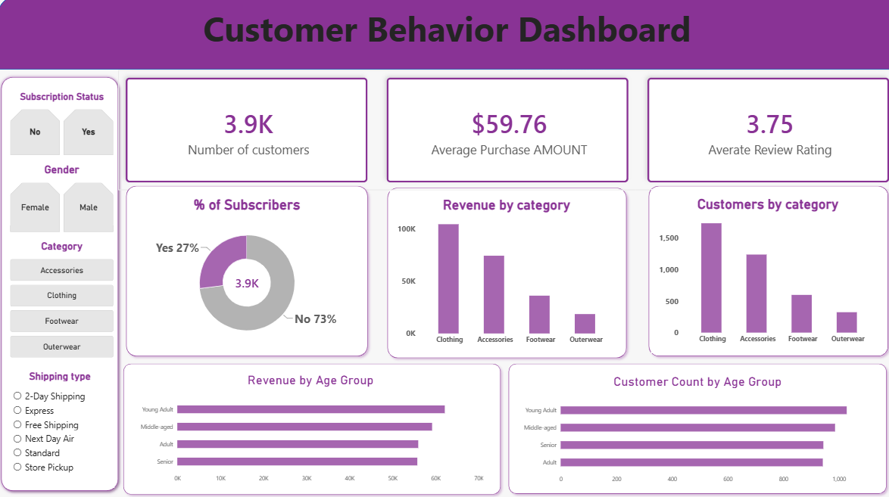

# 🛍️ Customer Shopping Behavior Analysis

### End-to-End Data Analytics Project using Python, MySQL & Power BI


---

## 📊 Project Overview

This project analyzes customer shopping behavior for a retail business to identify purchasing patterns, customer segments, product performance, discount behavior, and factors influencing customer spending.

The project follows an **end-to-end data analytics workflow**, starting with data exploration and cleaning in Python, followed by advanced SQL analysis in MySQL and interactive business intelligence reporting in Power BI.

The goal is to transform raw customer data into **actionable business insights** that can support marketing, customer engagement, product strategy, and revenue optimization.

---

## 🎯 Business Problem

A retail company wants to better understand its customers' shopping behavior in order to:

- Improve customer engagement
- Increase sales and revenue
- Identify valuable customer segments
- Understand purchasing patterns
- Evaluate the impact of discounts
- Identify high-performing products
- Analyze subscription behavior
- Understand demographic differences in spending
- Optimize marketing and product strategies

### Key Business Question

> **How can the company leverage customer shopping data to identify trends, improve customer engagement, and optimize marketing and product strategies?**

---

# 🔄 Project Workflow

```text
                    RAW CUSTOMER DATA
                           │
                           ▼
                  ┌─────────────────┐
                  │     Python      │
                  │ Pandas + Jupyter│
                  └────────┬────────┘
                           │
                    Data Cleaning
                    Data Exploration
                   Feature Engineering
                           │
                           ▼
                  ┌─────────────────┐
                  │      MySQL      │
                  │  SQL Analysis   │
                  └────────┬────────┘
                           │
                    Business Queries
                    CTEs & Subqueries
                    CASE Statements
                    Window Functions
                           │
                           ▼
                  ┌─────────────────┐
                  │    Power BI     │
                  │   Dashboard     │
                  └────────┬────────┘
                           │
                           ▼
                 Interactive Insights
                  & Business Decisions
```

---

# 🗂️ Dataset

The dataset contains customer-level shopping information.

Each row represents a customer's latest purchase and contains information related to demographics, products, spending, promotions, shipping, subscriptions, and purchasing behavior.

### Main Features

| Column | Description |
|---|---|
| `customer_id` | Unique customer identifier |
| `age` | Customer age |
| `gender` | Customer gender |
| `item_purchased` | Product purchased |
| `category` | Product category |
| `purchase_amount` | Amount spent on the purchase |
| `location` | Customer/purchase location |
| `size` | Product size |
| `color` | Product color |
| `season` | Season associated with purchase |
| `review_rating` | Customer review rating |
| `subscription_status` | Subscription status |
| `shipping_type` | Shipping method |
| `discount_applied` | Whether a discount was applied |
| `previous_purchases` | Number of previous purchases |
| `payment_method` | Payment method |
| `frequency_of_purchases` | Purchase frequency |

---

# 🐍 Phase 1 — Data Analysis & Cleaning with Python

Python and Pandas were used for initial data exploration, cleaning, and feature engineering.

### Exploratory Data Analysis

The dataset was inspected using:

- `df.head()`
- `df.info()`
- `df.describe()`
- Missing-value analysis
- Categorical-value inspection
- Data consistency checks

### Missing Value Treatment

The `review_rating` column contained missing values.

Instead of replacing all missing values with the overall median, the missing ratings were imputed using the **median rating within each product category**.

This preserves differences between categories and provides a more context-aware imputation strategy.

```python
df['review_rating'] = (
    df.groupby('category')['review_rating']
      .transform(lambda x: x.fillna(x.median()))
)
```

### Column Standardization

Column names were standardized into **snake_case** to make them easier to work with in both Python and SQL.

Example:

```text
Customer ID → customer_id
Purchase Amount USD → purchase_amount
Review Rating → review_rating
```

### Feature Engineering

Two additional features were created:

#### 1. Age Group

Customers were segmented into four age groups using quantile-based binning:

- Young Adult
- Adult
- Middle-aged
- Senior

#### 2. Purchase Frequency Days

Text-based purchase frequencies were converted into numerical day intervals.

For example:

```text
Weekly → 7 days
Fortnightly → 14 days
Monthly → 30 days
Quarterly → 90 days
```

This makes purchase frequency easier to analyze quantitatively.

### Redundant Column Removal

`promo_code_used` was compared with `discount_applied`.

Since both columns contained the same information in this dataset, the redundant `promo_code_used` column was removed.

---

## 🗄️ Phase 2 — SQL Analysis

The cleaned dataset was imported into **MySQL** for business-oriented data analysis. SQL queries were developed to answer key questions related to customer spending, discounts, subscriptions, product performance, customer loyalty, and revenue.

### 🔍 Business Questions & SQL Solutions

#### Q1. What is the total revenue generated by male vs female customers?

```sql
SELECT 
    gender, 
    SUM(purchase_amount) AS revenue
FROM customer_shopping_behavior
GROUP BY gender;
```

#### Q2. Which customers used a discount but still spent more than the average purchase amount?

```sql
SELECT 
    customer_id,
    purchase_amount,
    discount_applied
FROM customer_shopping_behavior
WHERE discount_applied = 'Yes'
  AND purchase_amount > (
      SELECT AVG(purchase_amount)
      FROM customer_shopping_behavior
  );
```

#### Q3. Which are the top 5 products with the highest average review rating?

```sql
SELECT 
    item_purchased, 
    ROUND(AVG(review_rating), 2) AS average_rating
FROM customer_shopping_behavior
GROUP BY item_purchased
ORDER BY average_rating DESC
LIMIT 5;
```

#### Q4. Compare the average purchase amounts between Standard and Express shipping.

```sql
SELECT 
    shipping_type, 
    ROUND(AVG(purchase_amount), 2) AS average_purchase_amt
FROM customer_shopping_behavior
WHERE shipping_type IN ('Express', 'Standard')
GROUP BY shipping_type;
```

#### Q5. Do subscribed customers spend more?

Compare the average spend and total revenue between subscribers and non-subscribers.

```sql
SELECT 
    subscription_status,
    COUNT(customer_id) AS total_customers,
    ROUND(AVG(purchase_amount), 2) AS average_spend,
    SUM(purchase_amount) AS total_revenue
FROM customer_shopping_behavior
GROUP BY subscription_status;
```

#### Q6. Which 5 products have the highest percentage of purchases with discounts applied?

```sql
SELECT 
    item_purchased, 
    ROUND(
        SUM(
            CASE 
                WHEN discount_applied = 'Yes' THEN 1 
                ELSE 0 
            END
        ) / COUNT(*) * 100, 
        2
    ) AS discount_rate
FROM customer_shopping_behavior
GROUP BY item_purchased
ORDER BY discount_rate DESC
LIMIT 5;
```

#### Q7. How can customers be segmented into New, Returning, and Loyal?

Customer segments are created based on the number of previous purchases.

```sql
SELECT 
    CASE 
        WHEN previous_purchases = 1 THEN 'New'
        WHEN previous_purchases BETWEEN 2 AND 10 THEN 'Returning'
        ELSE 'Loyal'
    END AS loyalty,
    COUNT(*) AS customer_count
FROM customer_shopping_behavior
GROUP BY loyalty
ORDER BY customer_count DESC;
```

#### Q8. What are the top 3 most purchased products within each category?

This analysis uses a **CTE** and the **ROW_NUMBER() window function** to rank products within each category.

```sql
WITH item_counts AS (
    SELECT 
        category, 
        item_purchased, 
        COUNT(customer_id) AS total_orders,
        ROW_NUMBER() OVER (
            PARTITION BY category 
            ORDER BY COUNT(customer_id) DESC
        ) AS item_rank
    FROM customer_shopping_behavior
    GROUP BY category, item_purchased
)

SELECT 
    item_rank,
    category,
    item_purchased,
    total_orders
FROM item_counts
WHERE item_rank <= 3
ORDER BY category, item_rank;
```

#### Q9. Are customers who are repeat buyers (more than 5 previous purchases) also likely to subscribe?

```sql
SELECT 
    subscription_status,
    COUNT(customer_id) AS repeat_buyers
FROM customer_shopping_behavior
WHERE previous_purchases > 5
GROUP BY subscription_status;
```

#### Q10. What is the revenue contribution of each age group?

```sql
SELECT 
    age_group, 
    SUM(purchase_amount) AS revenue
FROM customer_shopping_behavior
GROUP BY age_group
ORDER BY revenue DESC;
```

### 🧠 SQL Skills Demonstrated

* Aggregate functions — `SUM()`, `AVG()`, `COUNT()`
* Data filtering using `WHERE`
* Grouping and aggregation using `GROUP BY`
* Conditional logic using `CASE WHEN`
* Subqueries
* Common Table Expressions (CTEs)
* Window functions
* `ROW_NUMBER()` and `PARTITION BY`
* Sorting using `ORDER BY`
* Limiting results using `LIMIT`
* Customer segmentation
* Revenue analysis
* Discount analysis
* Subscription and customer behavior analysis

### 📌 Key Business Areas Analyzed

| Area             | Analysis                                        |
| ---------------- | ----------------------------------------------- |
| 💰 Revenue       | Revenue by gender and age group                 |
| 🛍️ Products     | Top-rated and most-purchased products           |
| 🎟️ Discounts    | Products with highest discount usage            |
| 👥 Customers     | New, Returning, and Loyal customer segments     |
| ⭐ Reviews        | Average product review ratings                  |
| 🚚 Shipping      | Standard vs Express purchase behavior           |
| 🔔 Subscriptions | Spending and repeat-buyer subscription behavior |

---


# 📈 Phase 3 — Power BI Dashboard

<p align="center">
  
</p>
The cleaned MySQL dataset was connected directly to **Power BI** to create an interactive customer behavior dashboard.

### Dashboard Features

The dashboard includes:

- 👥 Total Customers
- 💰 Average Purchase Amount
- ⭐ Average Review Rating
- 📊 Revenue by Category
- 📦 Sales by Category
- 👤 Revenue by Age Group
- 👥 Sales by Age Group
- 🧾 Subscription Status
- 🎯 Gender Filter
- 🛍️ Category Filter
- 🚚 Shipping Type Filter

### Dashboard Preview

```markdown

```

The dashboard is designed to allow users to interactively filter customer behavior by demographic and purchasing characteristics.

---

# 📌 Business Recommendations

Based on the analysis, the following actions could be considered:

### 1. Improve Subscription Conversion

Target high-frequency and repeat customers who have not subscribed with personalized membership benefits or exclusive offers.

### 2. Optimize Discount Strategy

Identify products with high discount dependency and evaluate whether discounts are generating incremental revenue or unnecessarily reducing margins.

### 3. Promote High-Rated Products

Feature highly rated products prominently in marketing campaigns and recommendation systems.

### 4. Develop Customer-Specific Marketing

Use customer segments and demographics to create more targeted campaigns rather than using a single strategy for the entire customer base.

### 5. Evaluate Premium Delivery

Since express-shipping customers show higher average purchase values, the company could evaluate premium delivery options as part of a broader customer experience strategy.

### 6. Focus on High-Value Customer Segments

Prioritize loyal and high-spending customers with retention campaigns, personalized recommendations, and exclusive offers.

---

# 🛠️ Tools & Technologies

| Tool | Purpose |
|---|---|
| 🐍 Python | Data cleaning, manipulation & exploration |
| 🐼 Pandas | Data analysis and transformation |
| 📓 Jupyter Notebook | Development & EDA |
| 🗄️ MySQL | Database storage & SQL analysis |
| 📊 Power BI | Interactive dashboard & visualization |
| 🧮 SQL | Business analysis & data querying |
| 🔢 DAX | Power BI measures and calculations |
| 🔧 GitHub | Version control & portfolio |

---

# 🧠 SQL Concepts Demonstrated

This project includes practical implementation of:

- `SELECT`
- `WHERE`
- `GROUP BY`
- `HAVING`
- `ORDER BY`
- `CASE`
- Aggregate Functions
- Subqueries
- CTEs (`WITH`)
- `ROW_NUMBER()`
- `PARTITION BY`
- `JOIN` concepts
- Conditional aggregation
- Ranking
- Customer segmentation

---

# 📁 Project Structure

```text
customer-shopping-behavior-analysis/
│
├── 📂 data/
│   ├── customer_shopping_behavior.csv
│   └── cleaned_customer_shopping_behavior.csv
│
├── 📂 python/
│   └── customer_behavior_analysis.ipynb
│
├── 📂 sql/
│   └── customer_behavior_analysis.sql
│
├── 📂 powerbi/
│   └── customer_behavior_dashboard.pbix
│
├── 📂 images/
│   └── customer_behavior_dashboard.png
│
├── 📄 README.md
└── 📄 LICENSE
```

---

# 🔗 End-to-End Data Pipeline

```text
CSV Dataset
     ↓
Python / Pandas
     ↓
Data Cleaning
     ↓
Feature Engineering
     ↓
MySQL Database
     ↓
SQL Business Analysis
     ↓
Power BI
     ↓
Interactive Dashboard
     ↓
Business Insights & Recommendations
```

---

# 🚀 What I Learned

Through this project, I strengthened my practical understanding of:

- Data cleaning using Pandas
- Handling missing values intelligently
- Feature engineering
- Exploratory data analysis
- SQL-based business analysis
- Common Table Expressions
- Window functions
- Customer segmentation
- Conditional aggregation
- Connecting MySQL with Power BI
- Building interactive dashboards
- Translating analytical findings into business recommendations

Most importantly, this project helped me understand how **Python, SQL, and Power BI work together in a complete analytics workflow**.

---

# 👨‍💻 About Me

I'm a banking professional transitioning into **Data Analytics / Business Analytics**, with hands-on experience in MIS reporting, Excel dashboards, sales performance tracking, and business reporting.

I'm currently expanding my technical skills in:

**SQL • Python • Pandas • Power BI • Excel • Data Visualization**

This project is part of my data analytics portfolio and demonstrates my ability to take a dataset from **raw data → cleaning → analysis → visualization → business insights**.

---

⭐ **If you found this project useful, feel free to star the repository!**

**Made with Python, SQL & Power BI.**
